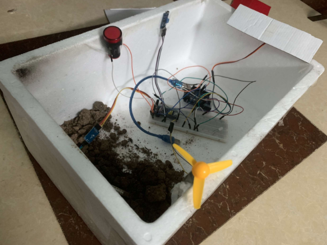
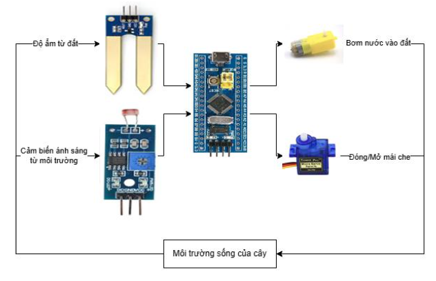

# Hệ thống chăm sóc cây thông minh

Trong bối cảnh phát triển nông nghiệp hiện đại, việc ứng dụng công nghệ tiên tiến nhằm tối ưu hóa quá trình chăm sóc cây
trồng
đang trở thành một xu hướng quan trọng. Đề
tài này tập trung vào việc nghiên cứu sử dụng
công nghệ cảm biến để quản lý và chăm sóc
cây trồng trong nông nghiệp. Hệ thống chăm
sóc cây thông minh được thiết kế để giám sát
và điều khiển tự động các yếu tố môi trường
sống của cây như độ ẩm đất và cường độ ánh
sáng, giúp đảm bảo điều kiện tối ưu cho sự phát
triển của cây trồng.

Hệ thống bao gồm các cảm biến độ ẩm đất và
cảm biến cường độ ánh sáng, vi điều khiển
STM32, máy bơm nước, và động cơ điều khiển
mái che. Các cảm biến đo lường các thông số
môi trường và gửi tín hiệu về vi điều khiển để
phân tích. Dựa trên dữ liệu thu thập, vi điều
khiển sẽ điều khiển máy bơm nước khi độ ẩm
đất dưới mức yêu cầu và điều chỉnh mái che
khi cường độ ánh sáng không phù hợp.
Sản phẩm sẽ có các đặc tính cơ bản sau:

- Tính linh hoạt: Sản phẩm được thiết kế
  để linh hoạt và có thể được tùy chỉnh cho các
  loại cây trồng và môi trường trồng trọt khác
  nhau. Điều này bao gồm việc cung cấp các tùy
  chọn cài đặt để phản ánh nhu cầu riêng của
  từng loại cây và điều kiện môi trường cụ thể.
  Sự linh hoạt này giúp sản phẩm phù hợp với
  nhiều loại hệ thống trồng trọt và đáp ứng được
  nhu cầu đa dạng của người nông dân. Ví dụ,
  sản phẩm có thể được lập trình để điều chỉnh
  mức độ tưới nước khác nhau cho các loại cây
  có nhu cầu nước khác nhau hoặc thay đổi
  cường độ ánh sáng cho các giai đoạn phát triển
  khác nhau của cây.
- Tính tự động hóa: Sản phẩm sẽ được
  trang bị các công nghệ tự động hóa cho phép
  nó tự động điều chỉnh hoạt động của máy bơm
  nước và mái che tự động dựa trên dữ liệu thu
  thập từ các cảm biến. Khi cảm biến đo độ ẩm
  đất phát hiện ra rằng đất đang khô cằn, sản
  phẩm sẽ kích hoạt máy bơm nước để tưới cây.
  Tương tự, khi cảm biến đo cường độ ánh sáng
  nhận thấy ánh sáng mặt trời đủ, sản phẩm sẽ tự
  động điều chỉnh mái che để bảo vệ cây trước
  ánh nắng mạnh. Hệ thống này giúp giảm bớt
  công việc thủ công cho người nông dân, cho
  phép họ tập trung vào các nhiệm vụ quan trọng
  khác.
- Tính hiệu quả: Mục tiêu chính của sản
  phẩm là tối ưu hóa sử dụng tài nguyên như
  nước và ánh sáng. Bằng cách cung cấp nước và
  ánh sáng theo nhu cầu thực tế của cây trồng và
  điều kiện môi trường, sản phẩm giúp tăng năng
  suất cây trồng trong khi giảm thiểu lãng phí tài
  nguyên. Điều này không chỉ mang lại hiệu
  quả kinh tế mà còn giúp bảo vệ môi trường và
  thúc đẩy sự phát triển bền vững trong ngành
  nông nghiệp. Ví dụ, việc tưới nước chính xác
  giúp tiết kiệm nước và giảm chi phí, đồng thời
  tránh tình trạng ngập úng và sâu bệnh.
  Nhìn chung, việc phát triển hệ thống chăm
  sóc cây thông minh không chỉ đáp ứng nhu cầu
  hiện tại của ngành nông nghiệp mà còn mở ra
  những cơ hội mới cho việc áp dụng công nghệ
  cao vào sản xuất nông nghiệp, góp phần vào sự
  phát triển bền vững của ngành này.

## Hình ảnh hệ thống thực tế

### Sơ đồ khối chức năng

### Các linh kiện sử dụng

| No | Tên linh kiện          | Điện áp hoạt động | Tín hiệu lối vào/ra | 
|:---|:-----------------------|:------------------|:--------------------|
| 1  | Cảm biến ánh sáng  | 3.3V ~ 5V     | Digital, Analog     | 
| 2  | Quang trở          | 3.3V ~ 5V     | Digital, Analog     | 
| 3  | Máy bơm nước       | 5V            | Digital             | 
| 4  | Servo SG90         | 5V            | Digital             | 

### Demo hệ thống: [Tại đây](https://youtu.be/c7vdNeubNYY)

### Report: [Tại đây](./pic/Report.pdf)

## Author

| No | Name                   | Id            | Github                                       | 
|:---|:-----------------------|:--------------|:---------------------------------------------|
| 1  | Phạm Văn Mạnh      | 21020449  | [@emvipi03](https://github.com/emvipi03)     | 
| 2  | Trần Khánh Phương  | 21020147  | [@FuongTran](https://github.com/FuongTran)   | 
| 3  | Nguyễn Đức Thành   | 21020456  | [@onionT-312](https://github.com/onionT-312) | 